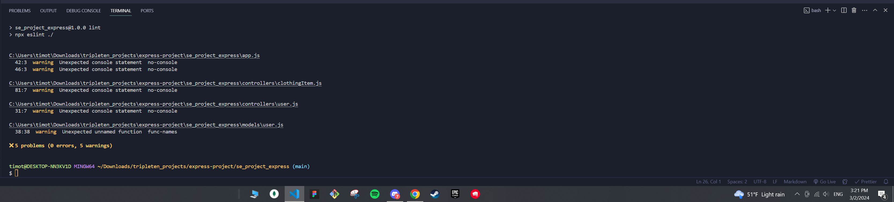

# WTWR (What to Wear?): Back End

This project is the backend half of the WTWR project! Created using:

- Node.js
- Express
- MongoDB
- Mongoose
- JSON Web Token

This project contains routes and controllers. They are used to get, create, and delete items on the front end of WTWR. This project also stores user data in the server which allows users to create an account. The requests were tested using postman to make sure they were being used appropriately.

# You can find the front-end code here:

=> https://github.com/timothyqchan/se_project_react

# You can find the live site to the entire application here:

- Front End
  => https://wtwrproject.crabdance.com

- Back End
  => https://api.wtwrproject.crabdance.com

To Reviewer for project 15:
I could not find the errors from npx eslint ./
I only found 5 warnings from Unexpected console statement

